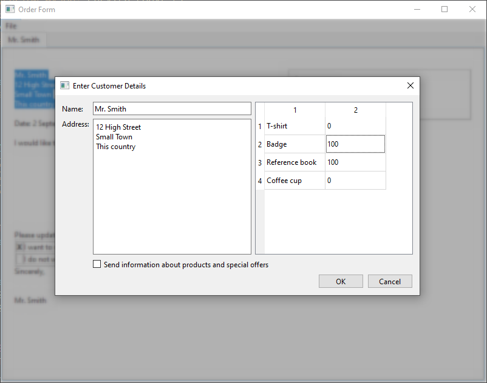
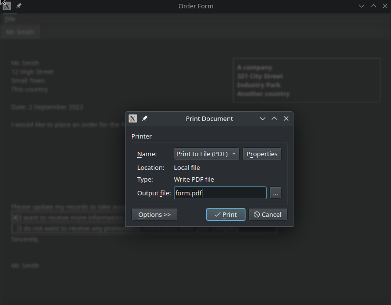

# Overlay widget for Qt

This project provides an Overlay QWidget class, that can be used with a modal QDialog to darken the background over the dialog parent widget, and to attach a Blur graphics effect on the parent as well.

This project is derived from the [Order Form](https://doc.qt.io/qt-6/qtwidgets-richtext-orderform-example.html) example.

## Why to use this

Some platforms, like Windows 10, do not dim/darken/blur automatically the parent window of modal dialogs. Qt does not add any effect that is not provided by the graphics compositor of the platform in this case. You may find that some Linux window managers already do something like this, but you probably want to give the users of your cross platform applications an uniform look and feel everywhere, independently of the platform. If so, this class is for you.

## How to use this

You only need to instantiate the Overlay widget just before opening a modal dialog, with the parent window as parent. The overlay will automatically be shown, and hidden upon destruction of the instance.

    void MainWindow::openDialog()
    {
        Overlay overlay(this);
        DetailsDialog dialog(tr("Enter Customer Details"), this);
    
        if (dialog.exec() == QDialog::Accepted) {
            createLetter(dialog.senderName(),
                         dialog.senderAddress(),
                         dialog.orderItems(),
                         dialog.sendOffers());
        }
    }

The `MainWindow::openDialog()` and `MainWindow::printFile()` methods use the Overlay class.

You may build this project with Qt5 or Qt6.

## License

Copyright © 2023 Pedro López-Cabanillas  
SPDX-License-Identifier: BSD-3-Clause

[detailed License document](LICENSE)
